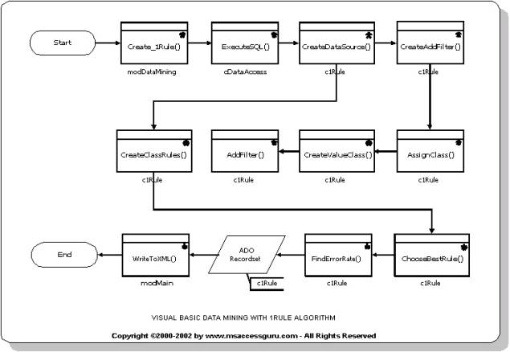



## Data Mining For A Visual Basic Programmer \- 1Rule

### Description

Data Mining for Visual Basic programmers - 1Rule is a complete Visual Basic data mining application for relational databases including Microsoft® Access®, Microsoft SQL Server®, Oracle® and Sybase ® databases.

The attached articles in HTML and Microsoft Word gives a detailed step by step guide to the development of the Visual Basic Data Mining application.

Interested programmers can download more free Visual Basic Data Mining Source Code from http://www.visual-basic-data-mining.net.

Also included is a free complete implementation of a data mining algorithm in VBA, Visual Basic and Microsoft Access 2000 for the Microsoft® Visual Basic® and Microsoft® Access® communities.
 
### More Info
 

             |
---                |---
**Submitted On**   |2002-04-05 09:06:10
**By**             |[visual\-basic\-data\-mining\.net](https://github.com/Planet-Source-Code/PSCIndex/blob/master/ByAuthor/visual-basic-data-mining-net.md)
**Level**          |Intermediate
**User Rating**    |4.0 (16 globes from 4 users)
**Compatibility**  |VB 5\.0, VB 6\.0, VBA MS Access
**Category**       |[Complete Applications](https://github.com/Planet-Source-Code/PSCIndex/blob/master/ByCategory/complete-applications__1-27.md)
**World**          |[Visual Basic](https://github.com/Planet-Source-Code/PSCIndex/blob/master/ByWorld/visual-basic.md)
**Archive File**   |[Data\_Minin69124452002\.zip](https://github.com/Planet-Source-Code/visual-basic-data-mining-net-data-mining-for-a-visual-basic-programmer-1rule__1-33477/archive/master.zip)

### Source Code

<html>
<head>
<meta http-equiv="Content-Type" content="text/html; charset=windows-1252">
<meta name="GENERATOR" content="Microsoft FrontPage 4.0">
<meta name="Keywords" content="Visual Basic Data Mining, Free Data Mining Source Code, Microsoft Access Data Mining, Data Mining Article, Data Mining Tutorial, Data Mining Algorithm, Data Mining Source Code, Free Visual Basic Data Mining Source Code">
<meta name="ProgId" content="FrontPage.Editor.Document">
<title>Free Visual Basic Data Mining Source Code , Application and Article</title>
</head>
<body>

<b><u>A Data Mining Article written by a Programmer for Programmers:</u></b> 
 
A Visual Basic Data Mining application for Relational Databases (RDBMS)
including Microsoft®<o:p>
</o:p>
 Access®,
Microsoft SQL Server®</o:p>
, Oracle®<o:p>
</o:p>
 and Sybase<o:p>
® </o:p>
databases. 

The attached articles in HTML and Microsoft Word
gives a <b><u> detailed step by step guide to the development of the Visual Basic Data Mining
application</u></b>. Interested programmers can download more <u>free Visual Basic Data Mining Source
Code</u> from <a href="http://www.visual-basic-data-mining.net"> http://www.visual-basic-data-mining.net</a>. 
Also included is a free complete implementation of a data mining algorithm in VBA,
Visual Basic and Microsoft Access 2000 for the Microsoft®
Visual Basic®
and Microsoft®
Access®
communities.

<b>Benefit: 
</b>The Data Mining algorithm is implemented fully in Visual Basic. It uses the
ActiveX Data Objects (ADO) provider for a relational database to access a data
mining database. <b><u>It fully implements the data mining algorithm in Visual
Basic code, completely eliminating any database specific SQL syntax,
stored procedures and queries.</u> </b>It needs only a simple SQL SELECT
statement to access a relational database. The only part of the data mining
application that changes is the SQL syntax used to select data from a specific
table and relational database. Hence the data mining application is truly
portable to any relational database where an ADO provider exists (most major
database vendors have ADO providers for their databases).

If a database administrator (DBA) or programmer wants to
port some of the Visual Basic code to a database server's SQL like T-SQL, it
will really be the DBA or programmer's decision.

<b>Another Benefit:</b> 
The data mining algorithm used is completely explained in pseudo code. Detailed
step by step tutorials in these articles guide the
programmer through the data mining process, data mining algorithm application
and Visual Basic Source Code development ! Also included is the sample data in
Microsoft Access®
and other file formats. In addition, <u>detailed diagrams (graphic files) give a
visual explanation</u> of a specific data mining process, data mining algorithm
and Visual Basic implementation of the data mining algorithm. 
 
Because of the size of the diagrams (graphics) the articles are contained in the attached
zip file. 
<b><u>A complete file download</u></b> including a more detailed Visual Basic Data Mining
tutorial with complete Visual Basic Source Code is freely available at <a href="http://www.visual-basic-data-mining.net">http://www.visual-basic-data-mining.net</a>.

 

</body>
</html>

